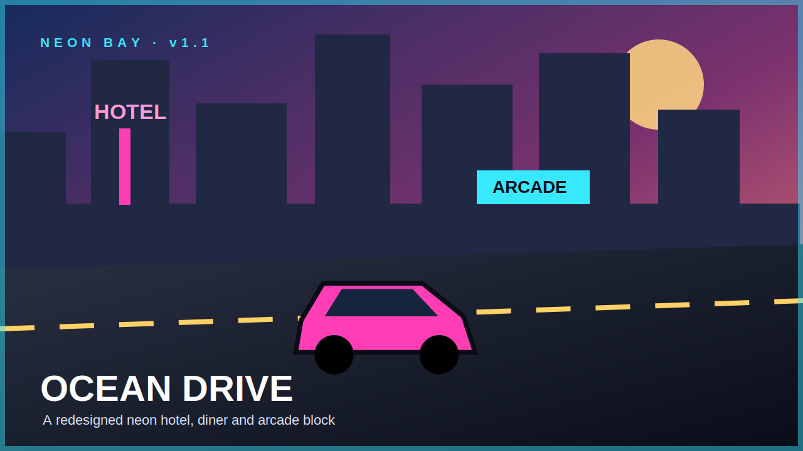
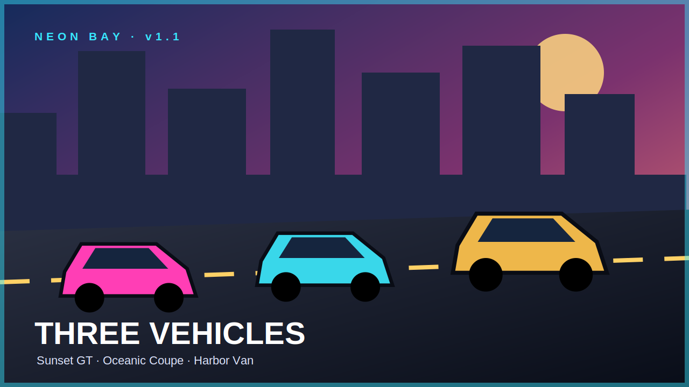
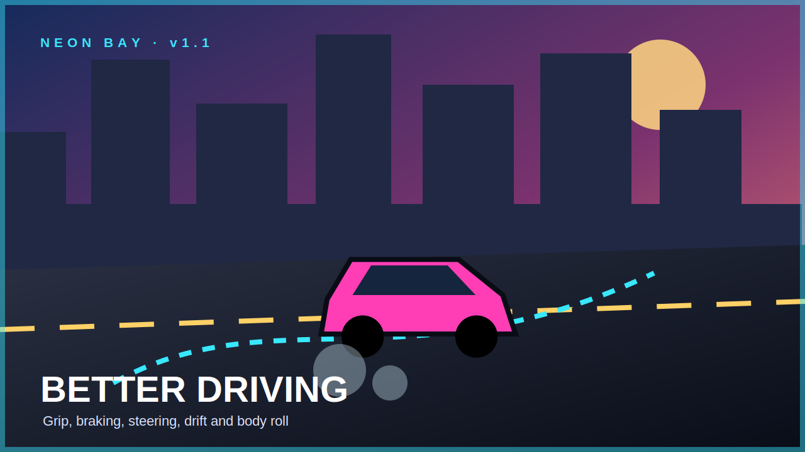
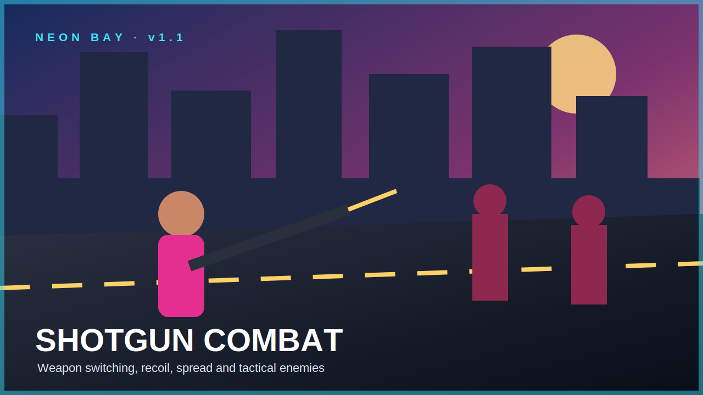
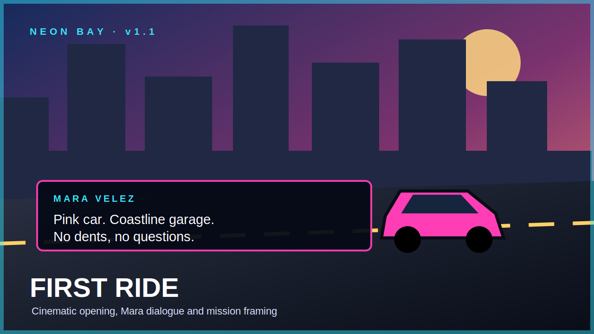
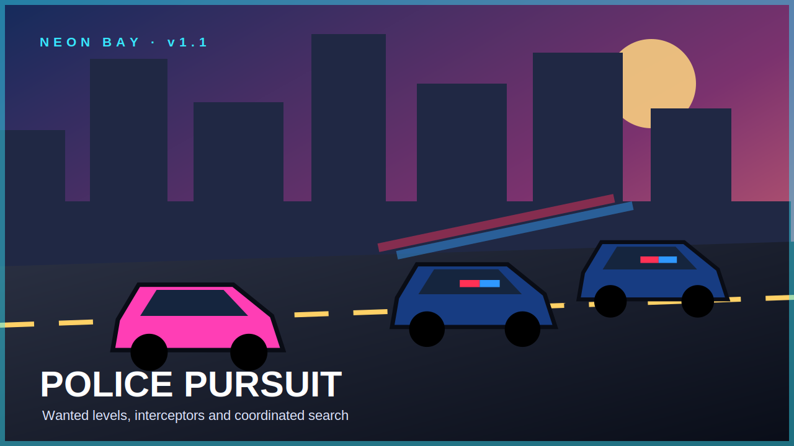

# Neon Bay v1.1

**Neon Bay** is an original browser-based 3D open-city action game built with Three.js, modular JavaScript and Vite. Chapter One contains five connected jobs, driving, combat, police pursuit, shops, saving, dynamic weather and desktop/mobile controls.

Version 1.1 focuses on presentation and game feel: an articulated player, distinct vehicle models and handling, shotgun combat, tactical enemy behavior, a redesigned city block and a cinematic opening mission.

## v1.1 trailer

[Watch the browser-based Neon Bay v1.1 trailer](public/trailer.html)

> The release media is an original promotional visualization of the game’s low-poly art direction. It is not presented as a GPU-recorded gameplay capture.

[](public/trailer.html)

## What changed in v1.1

- Articulated player model with idle, walking, sprinting, jumping, aiming and recoil poses
- Three redesigned vehicles: Sunset GT, Oceanic Coupe and Harbor Van
- Vehicle-specific speed, acceleration, braking, mass, steering, grip and drift behavior
- Animated front-wheel steering, suspension movement, body roll and brake lights
- Pistol and pump-shotgun weapon switching with separate ammunition and reload rules
- Enemy alert, search, attack and cover states
- Redesigned Ocean Drive block with a hotel, diner, arcade, awnings, benches, planters and neon signs
- First Ride opening cutscene and character dialogue
- Versioned save data that remembers the selected weapon and both ammunition inventories
- Modular source structure for player models, vehicles, content, cinematics and combat AI
- Dedicated module tests in addition to the existing smoke and mission-flow suites
- Six editable vector release screenshots and a browser-based animated trailer

## Promotional gallery

| Ocean Drive | Vehicle lineup |
|---|---|
|  |  |

| Driving physics | Shotgun combat |
|---|---|
|  |  |

| First Ride dialogue | Police chase |
|---|---|
|  |  |

## Chapter One

1. **First Ride** — meet Mara, take the Sunset GT and deliver it to the Coastline garage.
2. **Beach Exchange** — survive an ambush, attract police attention and escape to the marina.
3. **Hot Delivery** — secure a package and beat a timed pursuit to the safehouse.
4. **Warehouse Trouble** — clear a warehouse yard, recover a ledger and return it safely.
5. **District Boss** — defeat the boss and guards, then escape across the pier.

## Controls

| Action | Control |
|---|---|
| Move / drive | `W A S D` |
| Look / aim | Mouse |
| Sprint / vehicle boost | `Shift` |
| Jump / handbrake | `Space` |
| Enter, exit or interact | `E` |
| Shoot | Left mouse button |
| Reload | `R` |
| Select pistol / shotgun | `1` / `2` |
| Cycle weapon | `Q` |
| Pause | `Esc` |

Touch controls include movement, camera look, fire, jump, interaction and weapon swapping.

## Run locally

Node.js 20 or newer is required. Node.js 22 is recommended.

```bash
npm install
npm run dev
```

Open the URL shown by Vite, normally `http://localhost:5173`.

## Validate and build

```bash
npm test
```

The test command runs:

- JavaScript syntax validation
- Player, vehicle, weapon, cover-AI and cinematic module tests
- Menu, save and pause/resume smoke tests
- All five mission-flow tests
- Mission checkpoint collision-reachability checks
- The Vite production build

The deployable website is generated in `dist/`.

## Source architecture

```text
source/
├── main.part-00.jsfrag
├── ...
└── main.part-07.jsfrag
src/
├── styles.css
└── modules/
    ├── cinematic.js
    ├── combat-ai.js
    ├── content.js
    ├── player-model.js
    └── vehicle-model.js
```

The reusable gameplay systems are real ES modules. The world-orchestration entry file is kept in ordered readable source sections and assembled into `src/main.js` automatically before development, validation and production builds. This keeps repository uploads reliable while preserving normal module imports and a single Vite entrypoint.

## Deployment

### Vercel

Import the repository into Vercel. The included `vercel.json` selects Vite, runs `npm run build` and publishes `dist`. Future pushes to `main` can deploy automatically.

### GitHub Pages

The included workflow runs the complete test suite and deploys the Vite output.

1. Open **Settings → Pages**.
2. Choose **GitHub Actions** under Build and deployment.
3. Push a commit or manually run the Pages workflow.

### Netlify

The included `netlify.toml` defines the production build command, output directory and Node version.

## Release media

The repository includes six editable SVG promotional screenshots and an 18-second browser-based animated trailer. The downloadable source package also contains PNG exports and an MP4 trailer.

## Legal and scope

All characters, branding, missions, procedural artwork and synthesized audio are original to this project. The game takes inspiration from the general open-world action genre but does not use copied GTA maps, characters, music, logos, dialogue or other proprietary assets.

This is a polished browser-game vertical slice, not a commercial GTA-sized production. Expanding to a large open world would require dedicated artists, animators, audio production, extensive QA and a larger development team.
